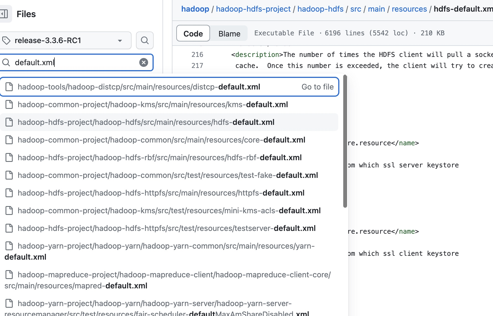
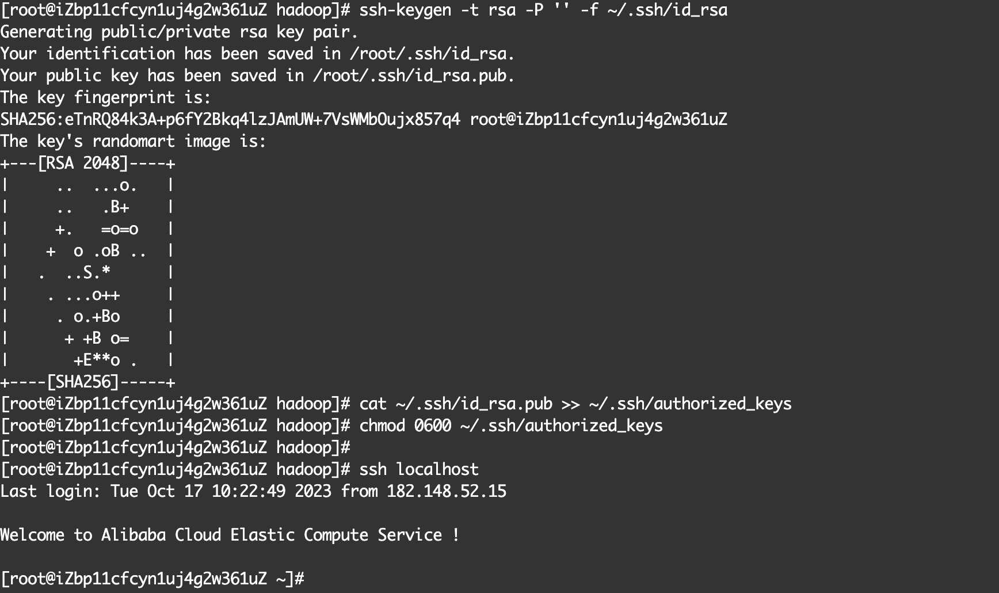

# Java的安装
在Apache Hadoop的[官方Wiki空间](https://cwiki.apache.org/confluence/display/HADOOP/Home)的[Hadoop Java Versions](https://cwiki.apache.org/confluence/display/HADOOP/Hadoop+Java+Versions)一文中说明了Hadoop支持的运行时Java版本为Java8和Java11，但是目前只能在Java8中进行编译,因此推荐的版本为Java8[^1]。

[^1]: 目前Hadoop正在实现能基于Java11版本编译，Jira Issue为[Java 11 compile support](https://issues.apache.org/jira/browse/HADOOP-16795)。

## 下载Java安装包
在Centos中，可以通过`yum install`命令快速安装一个软件，Java也是如此，安装Java8的过程如下：

1.先通过`yum search`命令搜索可用1.8版本：
```shell
[root@iZbp11cfcyn1uj4g2w361uZ output]# yum search java-1.8.0
Loaded plugins: fastestmirror
Loading mirror speeds from cached hostfile
===================================================================== N/S matched: java-1.8.0 ======================================================================
java-1.8.0-openjdk.i686 : OpenJDK Runtime Environment 8
java-1.8.0-openjdk.x86_64 : OpenJDK 8 Runtime Environment
java-1.8.0-openjdk-accessibility.i686 : OpenJDK accessibility connector
java-1.8.0-openjdk-accessibility.x86_64 : OpenJDK accessibility connector
java-1.8.0-openjdk-demo.i686 : OpenJDK Demos 8
java-1.8.0-openjdk-demo.x86_64 : OpenJDK 8 Demos
java-1.8.0-openjdk-devel.i686 : OpenJDK Development Environment 8
java-1.8.0-openjdk-devel.x86_64 : OpenJDK 8 Development Environment
java-1.8.0-openjdk-headless.i686 : OpenJDK Headless Runtime Environment 8
java-1.8.0-openjdk-headless.x86_64 : OpenJDK 8 Headless Runtime Environment
java-1.8.0-openjdk-javadoc.noarch : OpenJDK 8 API documentation
java-1.8.0-openjdk-javadoc-zip.noarch : OpenJDK 8 API documentation compressed in a single archive
java-1.8.0-openjdk-src.i686 : OpenJDK Source Bundle 8
java-1.8.0-openjdk-src.x86_64 : OpenJDK 8 Source Bundle
```
2.选择java-1.8.0-openjdk-devel.x86_64版本并安装[^2]：
```shell
[root@iZbp11cfcyn1uj4g2w361uZ ~]#yum install yum install java-1.8.0-openjdk-devel.x86_64
```
[^2]:从`yum search`命令的搜索结果描述就可以看出来，带devel结尾的表示当前包是开发包，即对应着JDK——里面包含开发调试需要的编译器（`javac`）、调试器（如`jdb`、`jps` `jstack`命令等）以及API文档生成工具（javadoc）等。不带devel结尾的只包含运行时环境（JRE）。因此如果使用`java-1.8.0-openjdk.x86_64`安装包，最终发现环境变量配置好以后，使用`jps` `jstack`等命令时依旧会提示`command not found`。

## 设置环境变量

在任意目录下执行`vim ~/.bash_profile`,末尾增加运行Java命令相关的系统变量：
```shell
export JAVA_HOME=/usr/lib/jvm/java-1.8.0-openjdk-1.8.0.382.b05-1.el7_9.x86_64/jre
export CLASSPATH=.:$JAVA_HOME/jre/lib/rt.jar:$JAVA_HOME/lib/dt.jar:$JAVA_HOME/lib/tools.jar
PATH=$JAVA_HOME/bin:$PATH:$HOME/bin
export PATH
```
* `JAVA_HOME`环境变量指向计算机上安装 `Java Runtime Environment (JRE)` 的目录。
* `CLASSPATH`环境变量用于指定Java虚拟机（JVM）在运行Java程序时查找类文件的路径。一般来说都是Java自身的基础库；
* `PATH`表示一组包含可执行文件的目录，从而可以快速执行脚本命令，而不必进入到脚本所在目录中。

保存好最新的文件以后，通过`source ~/.bash_profile`命令使得`bash_profile`文件立即生效，而不必注销并重新登录。


最终，全量的`bash_profile`文件如下所示：
```
# .bash_profile

# Get the aliases and functions
if [ -f ~/.bashrc ]; then
        . ~/.bashrc
fi

# User specific environment and startup programs
export JAVA_HOME=/usr/lib/jvm/java-1.8.0-openjdk-1.8.0.382.b05-1.el7_9.x86_64/jre
export CLASSPATH=.:$JAVA_HOME/jre/lib/rt.jar:$JAVA_HOME/lib/dt.jar:$JAVA_HOME/lib/tools.jar
PATH=$JAVA_HOME/bin:$PATH:$HOME/bin
export PATH
```

通过`java -version`命令和`jps`命令验证java是否安装正确。


# Hadoop安装

## Hadoop下载
当前官网最新的版本是`3.3.6`版本，因此推荐直接下载最新的版本。Hadoop下载有两种方式：
- 在`Apache Hadoop`官方网站的[Releases](https://hadoop.apache.org/releases.html)页面下载二进制文件。
- 如果是在国内的环境，下载速度非常慢，因此推荐使用[清华大学开源软件镜像站](https://mirrors.tuna.tsinghua.edu.cn/)，进度到`apache`目录搜索`hadoop`，找到对应的版本进行下载：

下载并解压的命令如下：
```shell
[root@iZbp11cfcyn1uj4g2w361uZ ~]# wget  https://mirrors.tuna.tsinghua.edu.cn/apache/hadoop/common/hadoop-3.3.6/hadoop-3.3.6.tar.gz
[root@iZbp11cfcyn1uj4g2w361uZ ~]# tar -zxvf hadoop-3.3.6.tar.gz
```
解压之后，可以看到如下的文件结构：

* bin目录：包含了`Hadoop`的可执行文件，例如`hadoop命令`和其他辅助工具。
* sbin目录：包含了`Hadoop`的系统级可执行文件，例如`start-dfs.sh`和`start-yarn.sh`等，用于启动和停止`Hadoop`的分布式文件系统（`DFS`）和资源管理器（`YARN`）。
* etc目录：包含了`Hadoop`的配置文件，包括核心配置文件（`core-site.xml`）、HDFS配置文件（`hdfs-site.xml`）、YARN配置文件（`yarn-site.xml`）等。
* lib目录：包含了`Hadoop`的`库文件`，包括`依赖的JAR文件`和其他扩展库等。
* libexec：各个服务对应的shell配置文件所在的目录，可用于`配置日志输出目录`、`启动参数（比如JVM参数）`等基本信息。
* share目录：包含了`Hadoop`的`共享资源文件`，例如`Hadoop的示例配置文件和脚本`等。
* include目录：`对外提供的编程库头文件（具体的动态库和静态库在lib目录中）`，这些文件都是用`C++`定义的，主要用于C++来访问Hadoop系统。

### 设置环境变量
```
[root@iZbp11cfcyn1uj4g2w361uZ hadoop-3.3.6]# cat ~/.bash_profile 
# .bash_profile

# Get the aliases and functions
if [ -f ~/.bashrc ]; then
        . ~/.bashrc
fi

# User specific environment and startup programs
export JAVA_HOME=/usr/lib/jvm/java-1.8.0-openjdk-1.8.0.382.b05-1.el7_9.x86_64/jre
export CLASSPATH=.:$JAVA_HOME/jre/lib/rt.jar:$JAVA_HOME/lib/dt.jar:$JAVA_HOME/lib/tools.jar
export HADOOP_HOME=/root/hadoop-3.3.6
export HADOOP_COMMON_LIB_NATIVE_DIR=$HADOOP_HOME/lib/native
export HADOOP_OPTS="-Djava.library.path=$HADOOP_HOME/lib"
export PATH=$JAVA_HOME/bin:$PATH:$HOME/bin:$HADOOP_HOME/bin:$PATH:.
export PATH
```

## Hadoop的运行模式
Hadoop的有三种运行模式,分别是单机模式（`Standalone Operation`）伪分布式模式（`Pseudo-Distrubuted Mode`）。以及全分布式模式（`Fully-Distributed Operation`）。
### 单机模式（`Standalone Operation`）
默认情况下`Hadoop`即处于该模式，用于开发和调式，主要特点如下：
*  不对配置文件进行修改,直接可以运行；
*  **使用本地文件系统，而不是分布式文件系统；** 
*  `Hadoop`不会启动`NameNode`、`DataNode`、`JobTracker`、`TaskTracker`等守护进程，`Map和Reduce()任务作为同一个进程的不同部分来执行`。

### 伪分布式模式（Pseudo-Distrubuted Mode）。
Hadoop运行在一台主机，通过不同的java进程模拟多主机。主要特点是Hadoop启动`NameNode`、`SecondaryNameNode`、`DataNode`、`JobTraker`等进程虽然是相互独立的Java进程，但是都在同一台机器上运行的。在这种模式下，`Hadoop`使用的是分布式文件系统，各个作业也是由`JobTraker`服务，来管理的独立进程。在单机模式之上增加了代码调试功能，允许检查内存使用情况，HDFS输入输出以及其他的守护进程交互。类似于完全分布式模式，因此，这种模式常用来开发测试Hadoop程序的执行是否正确。
### 全分布式模式（Pseudo-Distrubuted Mode）。　
　很好理解。https://hadoop.apache.org/docs/r3.3.6/hadoop-project-dist/hadoop-common/ClusterSetup.html
　　
### 单机模式（独立模式）
默认情况下，Hadoop配置都是以单个Java进程的形式的运行的，这种运行模式就叫做单机模式或者独立模式。这种模式只要配置好Java变量即可运行，对Debug很有用。

下面这个示例将Hadoop中的配置文件（etc/hadoop目录下的所有xml文件）作为输入，然后查找xml文件中所有匹配正则表达式的文本，并输出到给定的output目录：
```shell
[root@iZbp11cfcyn1uj4g2w361uZ hadoop-3.3.6]# mkdir input
[root@iZbp11cfcyn1uj4g2w361uZ hadoop-3.3.6]# mkdir output
[root@iZbp11cfcyn1uj4g2w361uZ hadoop-3.3.6]cp etc/hadoop/*.xml  input
[root@iZbp11cfcyn1uj4g2w361uZ hadoop-3.3.6]# bin/hadoop jar share/hadoop/mapreduce/hadoop-mapreduce-examples-3.3.6.jar grep input output 'dfs[a-z.]+'
```
运行完成以后，output目录多了两个文件：
```
[root@iZbp11cfcyn1uj4g2w361uZ output]# ls -l
total 4
-rw-r--r-- 1 root root 11 Oct 14 18:57 part-r-00000
-rw-r--r-- 1 root root  0 Oct 14 18:57 _SUCCESS
```
`_SUCCESS`空文件用来表示该任务运行成功,真正的执行结果在`part-r-00000`这个文件中，通过cat命令可以看到执行的结果：

```shell
[root@iZbp11cfcyn1uj4g2w361uZ output]# cat part-r-00000
1       dfsadmin
```


## 伪分布式模式

-修改3个配置文件：core-site.xml（Hadoop集群的特性，作用于全部进程及客户端）、hdfs-site.xml（配置HDFS集群的工作属性）、mapred-site.xml（配置MapReduce集群的属性）
　　-格式化文件系统

前面提到etc就是Hadoop的配置文件夹。

因此，进入到etc目录中：


core-site.xml

```
<?xml version="1.0" encoding="UTF-8"?>
<?xml-stylesheet type="text/xsl" href="configuration.xsl"?>
<!--
  Licensed under the Apache License, Version 2.0 (the "License");
  you may not use this file except in compliance with the License.
  You may obtain a copy of the License at

    http://www.apache.org/licenses/LICENSE-2.0

  Unless required by applicable law or agreed to in writing, software
  distributed under the License is distributed on an "AS IS" BASIS,
  WITHOUT WARRANTIES OR CONDITIONS OF ANY KIND, either express or implied.
  See the License for the specific language governing permissions and
  limitations under the License. See accompanying LICENSE file.
-->

<!-- Put site-specific property overrides in this file. -->

<configuration>
</configuration>

```


hadoop core-site.xml文件的作用

hadoop core-site.xml文件是Hadoop的核心配置文件之一，主要用于配置Hadoop集群的一些核心参数。

作用如下：
1. 配置Hadoop集群的文件系统：通过设置fs.defaultFS属性来指定Hadoop集群的默认文件系统，可以是本地文件系统（file://）或者HDFS（hdfs://）。
2. 配置Hadoop集群的安全认证和权限控制：通过设置hadoop.security.authentication属性来指定Hadoop的安全认证机制，如简单认证（simple）、Kerberos认证（kerberos）等。还可以通过设置hadoop.proxyuser.<user>.groups和hadoop.proxyuser.<user>.hosts属性来配置代理用户的权限。
3. 配置Hadoop集群的日志和工作目录：可以通过设置hadoop.log.dir属性来指定Hadoop的日志存储路径，通过设置hadoop.tmp.dir属性来指定Hadoop的临时工作目录。
4. 配置Hadoop集群的备份和恢复：通过设置hadoop.io.file.buffer.size属性来指定文件系统的读写缓冲区大小，通过设置fs.trash.interval属性来指定删除文件到垃圾回收站前的存储时间。
5. 配置Hadoop集群的RPC通信：通过设置ipc.client.connect.timeout属性来指定客户端连接到Hadoop集群的超时时间，通过设置ipc.server.listen.queue.size属性来指定服务器端监听队列的长度。
6. 配置Hadoop集群的压缩编解码：通过设置io.compression.codec属性来指定Hadoop集群的压缩编解码方式，如Snappy、LZO等。
7. 配置Hadoop集群的其他参数：还可以通过core-site.xml文件来配置其他Hadoop集群的参数，如Java虚拟机的最大内存限制（hadoop.opts）等。

总之，core-site.xml文件的作用是配置Hadoop集群的一些核心参数，对Hadoop集群的性能、安全、日志、工作目录等方面起到重要的作用。


fs.defaultFS

hadoop.tmp.dir

hadoop.tmp.dir是Hadoop配置文件中的一个属性，用于指定Hadoop临时文件目录的路径。该配置的作用如下：

1. 存储临时文件：Hadoop在运行过程中会产生大量的临时文件，包括缓存文件、日志文件、中间计算结果等。hadoop.tmp.dir用于指定这些临时文件的存储路径。

2. 确保文件系统空间充足：Hadoop使用分布式文件系统进行数据存储和计算，hadoop.tmp.dir的配置可以确保文件系统有足够的空间来处理临时文件。

3. 提高性能：将临时文件存储在本地磁盘上，可以减少网络传输的开销，并提高计算任务的性能。

需要注意的是，hadoop.tmp.dir的配置应当指定到一个可用空间较大的分区，以免临时文件过多导致磁盘空间不足。同时，hadoop.tmp.dir所在的磁盘应当具备较快的读写速度，以保证计算任务的效率。

/tmp/hadoop-${user.name} 默认值》

这里直接在hadoop的安装目录中新建了一个tmp目录


```xml
<?xml version="1.0" encoding="UTF-8"?>
<?xml-stylesheet type="text/xsl" href="configuration.xsl"?>

<configuration>
  <property>
    <name>fs.defaultFS</name>
    <value>hdfs://localhost:9000</value>
  </property>

  <property>
    <name>hadoop.tmp.dir</name>
    <value>/root/data/hadoop/tmp</value>
  </property>
</configuration>
```


 hdfs-site.xml配置如下：
 

```xml
<?xml version="1.0" encoding="UTF-8"?>
<?xml-stylesheet type="text/xsl" href="configuration.xsl"?>
<configuration>
 <property>
        <name>dfs.replication</name>
        <value>1</value>
    </property>
</configuration>

```


https://hadoop.apache.org/docs/stable/hadoop-project-dist/hadoop-common/SingleCluster.html#Prepare_to_Start_the_Hadoop_Cluster


  

  
  


### Pseudo-Distributed Operation


## default文件

如果不配置。hadoop将会设置一系列的默认值。
core-default.xml 文件位于 hadoop-common 和 hadoop-hdfs jar 中（您将在 share/hadoop/* 中找到它们）。您不需要在类路径上明确地显示这些文件，因为它们是从 jar 中读取的。（您可以从此处找到它们的属性：[ 1 ]）。

这些不应该被修改，因为它们是只读的默认配置。

有四种这样的默认只读配置 -

core-default.xml
hdfs-default.xml
yarn-default.xml
mapred-default.xml
https://github.com/apache/hadoop/blob/release-3.3.6-RC1/hadoop-hdfs-project/hadoop-hdfs/src/main/resources/hdfs-default.xml

或者直接在github中搜索文件名称,就像下面这样：github上面搜索-default.xml


### 配置SSH
不管是Hadoop的伪分布还是全分布，Hadoop的名称结点（NameNode）都需要启动集群中所有机器的Hadoop守护进程，而这个过程可以通过SSH登录来实现。由于Hadoop并没有提供SSH输入密码登录的形式，因此，为了能够顺利登录每台机器，就需要对其进行SSH的免密登录配置。
如果ssh出现密码，则需要配置SSH免密登录。


```
  $ ssh-keygen -t rsa -P '' -f ~/.ssh/id_rsa
  $ cat ~/.ssh/id_rsa.pub >> ~/.ssh/authorized_keys
  $ chmod 0600 ~/.ssh/authorized_keys
```

如果想使用https://www.cnblogs.com/librarookie/p/15389876.html
```
  $ ssh-keygen -t ed25519 -P '' -f ~/.ssh/id_ed25519
  $ cat ~/.ssh/id_ed25519.pub >> ~/.ssh/authorized_keys
  $ chmod 0600 ~/.ssh/authorized_keys
  ```
  
  
 

### 启动集群
#### 格式化NameNode

如果hadoop集群是第一次启动。那么需要格式化NameNode。

进入到bin目录
`hdfs namenode -format`

如果没有报错

```
2023-10-17 11:38:02,198 INFO common.Storage: Storage directory /root/data/hadoop/tmp/dfs/name has been successfully formatted.
2023-10-17 11:38:02,234 INFO namenode.FSImageFormatProtobuf: Saving image file /root/data/hadoop/tmp/dfs/name/current/fsimage.ckpt_0000000000000000000 using no compression
2023-10-17 11:38:02,355 INFO namenode.FSImageFormatProtobuf: Image file /root/data/hadoop/tmp/dfs/name/current/fsimage.ckpt_0000000000000000000 of size 399 bytes saved in 0 seconds .
```

进入到hadoop.tmp.dir，可以看到多了在上面执行日志中提到的文件夹。

```
[root@iZbp11cfcyn1uj4g2w361uZ hadoop-3.3.6]# ls -l
total 124
drwxr-xr-x 2 1000 1000  4096 Jun 18 17:08 bin
drwxr-xr-x 3 1000 1000  4096 Jun 18 16:24 etc
drwxr-xr-x 2 1000 1000  4096 Jun 18 17:08 include
drwxr-xr-x 2 root root  4096 Oct 14 18:44 input
drwxr-xr-x 3 1000 1000  4096 Jun 18 17:08 lib
drwxr-xr-x 4 1000 1000  4096 Jun 18 17:08 libexec
-rw-rw-r-- 1 1000 1000 24276 Jun 14 08:16 LICENSE-binary
drwxr-xr-x 2 1000 1000  4096 Jun 18 17:08 licenses-binary
-rw-rw-r-- 1 1000 1000 15217 Jun 10 07:41 LICENSE.txt
drwxr-xr-x 2 root root  4096 Oct 17 11:38 logs
-rw-rw-r-- 1 1000 1000 29473 Jun 10 07:41 NOTICE-binary
-rw-rw-r-- 1 1000 1000  1541 Jun 10 07:33 NOTICE.txt
drwxr-xr-x 2 root root  4096 Oct 14 18:57 output
-rw-rw-r-- 1 1000 1000   175 Jun 10 07:33 README.txt
drwxr-xr-x 3 1000 1000  4096 Jun 18 16:24 sbin
drwxr-xr-x 4 1000 1000  4096 Jun 18 17:37 share
```


```
[root@iZbp11cfcyn1uj4g2w361uZ sbin]# ./start-dfs.sh
Starting namenodes on [localhost]
ERROR: Attempting to operate on hdfs namenode as root
ERROR: but there is no HDFS_NAMENODE_USER defined. Aborting operation.
Starting datanodes
ERROR: Attempting to operate on hdfs datanode as root
ERROR: but there is no HDFS_DATANODE_USER defined. Aborting operation.
Starting secondary namenodes [iZbp11cfcyn1uj4g2w361uZ]
ERROR: Attempting to operate on hdfs secondarynamenode as root
ERROR: but there is no HDFS_SECONDARYNAMENODE_USER defined. Aborting operation.
```
这是因为hadoop默认的运行用户为HDFS

```
#
# To prevent accidents, shell commands be (superficially) locked
# to only allow certain users to execute certain subcommands.
# It uses the format of (command)_(subcommand)_USER.
#
# For example, to limit who can execute the namenode command,
# export HDFS_NAMENODE_USER=hdfs
```

hadoop-env.sh 直接在开头添加内容：

export HDFS_NAMENODE_USER=root
export HDFS_DATANODE_USER=root
export HDFS_SECONDARYNAMENODE_USER=root
export YARN_RESOURCEMANAGER_USER=root
export YARN_NODEMANAGER_USER=root

在集群环境下，即使各结点都正确地配置了JAVA_HOME，也会报如下错误:
```
[root@iZbp11cfcyn1uj4g2w361uZ hadoop-3.3.6]# sbin/start-dfs.sh
Starting namenodes on [localhost]
Last login: Tue Oct 17 10:49:13 CST 2023 from 127.0.0.1 on pts/1
localhost: ERROR: JAVA_HOME is not set and could not be found.
Starting datanodes
Last login: Tue Oct 17 13:53:52 CST 2023 on pts/1
localhost: ERROR: JAVA_HOME is not set and could not be found.
Starting secondary namenodes [iZbp11cfcyn1uj4g2w361uZ]
Last login: Tue Oct 17 13:53:52 CST 2023 on pts/1
iZbp11cfcyn1uj4g2w361uZ: Warning: Permanently added 'izbp11cfcyn1uj4g2w361uz,172.31.2.229' (ECDSA) to the list of known hosts.
iZbp11cfcyn1uj4g2w361uZ: ERROR: JAVA_HOME is not set and could not be found.
```
需要显示指定
```
export JAVA_HOME=/usr/lib/jvm/java-1.8.0-openjdk-1.8.0.382.b05-1.el7_9.x86_64/jre
```

重新启动：
```
[root@iZbp11cfcyn1uj4g2w361uZ hadoop-3.3.6]# sbin/start-dfs.sh
Starting namenodes on [localhost]
Last login: Tue Oct 17 13:53:53 CST 2023 on pts/1
Starting datanodes
Last login: Tue Oct 17 14:01:02 CST 2023 on pts/1
Starting secondary namenodes [iZbp11cfcyn1uj4g2w361uZ]
```
启动成功

```
[root@iZbp11cfcyn1uj4g2w361uZ bin]# jps
18725 DataNode
18587 NameNode
18957 SecondaryNameNode
19262 Jps
```

https://github.com/apache/hadoop/blob/release-3.3.6-RC1/hadoop-hdfs-project/hadoop-hdfs/src/main/resources/hdfs-default.xml
中
<property>
  <name>dfs.namenode.http-address</name>
  <value>0.0.0.0:9870</value>
  <description>
    The address and the base port where the dfs namenode web ui will listen on.
  </description>
</property>

因此，打开http://localhost:9870/ 由于我的是阿里云。或则换到固定的公网IP可以看到webUI。


### 在伪分布式下提交任务
现在，文件系统已经设置，因此可以将文件设置到HDFS中间而不是宿主机的自带目录（与单机比较，单机模式只是验证Map Reduce是否正确而已）。


## 文件系统设计
跟本机是一样的设计理念。

```shell
[root@iZbp11cfcyn1uj4g2w361uZ hadoop-3.3.6]# hadoop fs -mkdir /test
2023-10-18 17:47:15,725 WARN util.NativeCodeLoader: Unable to load native-hadoop library for your platform... using builtin-java classes where applicable
```

```
[root@iZbp11cfcyn1uj4g2w361uZ hadoop-3.3.6]# hdfs dfs -put etc/hadoop/*.xml /tes
```
```
[root@iZbp11cfcyn1uj4g2w361uZ hadoop-3.3.6]# hdfs dfs -ls /test
2023-10-18 17:52:44,959 WARN util.NativeCodeLoader: Unable to load native-hadoop library for your platform... using builtin-java classes where applicable
Found 10 items
-rw-r--r--   1 root supergroup       9213 2023-10-18 17:50 /test/capacity-scheduler.xml
-rw-r--r--   1 root supergroup        974 2023-10-18 17:50 /test/core-site.xml
-rw-r--r--   1 root supergroup      11765 2023-10-18 17:51 /test/hadoop-policy.xml
-rw-r--r--   1 root supergroup        683 2023-10-18 17:51 /test/hdfs-rbf-site.xml
-rw-r--r--   1 root supergroup        864 2023-10-18 17:51 /test/hdfs-site.xml
-rw-r--r--   1 root supergroup        620 2023-10-18 17:51 /test/httpfs-site.xml
-rw-r--r--   1 root supergroup       3518 2023-10-18 17:51 /test/kms-acls.xml
-rw-r--r--   1 root supergroup        682 2023-10-18 17:51 /test/kms-site.xml
-rw-r--r--   1 root supergroup        758 2023-10-18 17:51 /test/mapred-site.xml
-rw-r--r--   1 root supergroup        690 2023-10-18 17:51 /test/yarn-site.xml
```
命令：-开头
第一个参数：-开通  通常都是本地目录。
第二个参数 HDSF系统的目录

文件存储到哪里了？
```
/root/data/hadoop/tmp/dfs/data/current/BP-967858599-172.31.2.229-1697513882174/current/finalized/subdir0/subdir0
```
```
[root@iZbp11cfcyn1uj4g2w361uZ subdir0]# cd subdir0/
[root@iZbp11cfcyn1uj4g2w361uZ subdir0]# ls
blk_1073741825            blk_1073741827            blk_1073741829            blk_1073741831            blk_1073741833
blk_1073741825_1001.meta  blk_1073741827_1003.meta  blk_1073741829_1005.meta  blk_1073741831_1007.meta  blk_1073741833_1009.meta
blk_1073741826            blk_1073741828            blk_1073741830            blk_1073741832            blk_1073741834
blk_1073741826_1002.meta  blk_1073741828_1004.meta  blk_1073741830_1006.meta  blk_1073741832_1008.meta  blk_1073741834_1010.meta

```

cat一下blk_1073741828就发现这是一个xml配置文件夹。
